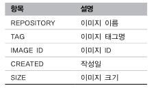

Docker 기본 명령어
-----

> Docker 버전 확인
> ```bash
> $ docker version
> ```

> Docker 실행 환경 확인
> - Docker 실행 환경의 상세 설정이 표시
> ```bash
> $ docker system info
> ```

> Docker 디스크 이용 상황
> - Docker가 사용하고 있는 디스크의 이용 상황이 표시
> ```bash
> $ docker system df
> ```

> Docker 이미지 다운로드
> nginx를 클라이언트 PC로 이미지 다운로드
> ```bash
> $ docker image pull [옵션] 이미지명[:태크명]
> ```
> 옵션
> - -a: 모든 태그를 취득할 수 있다. -a 옵션을 지장할 때는 이미지명에 태그를 지정 불가.
>
> 

> Docker 이미지 확인
> ```bash
> $ docker image ls
> ```
>
> 

> 이미지 상세 정보 확인
> ```bash
> $ docker image inspect 이미지명
> ```
>
> 

> 이미지 태그 설정
> ```bash
> $ docker image tag <Docker Hub 사용자명>/이미지명:[태크명]
> ```
>
> 