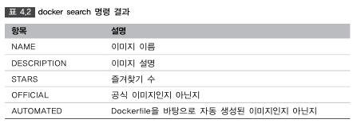
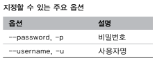

4.1 Docker 이미지 조작 명령어
=====

> #### Docker 버전 확인
> ```bash
> $ docker version
> ```

> #### Docker 실행 환경 확인
> - Docker 실행 환경의 상세 설정이 표시
> ```bash
> $ docker system info
> ```

> #### Docker 디스크 이용 상황
> - Docker가 사용하고 있는 디스크의 이용 상황이 표시
> ```bash
> $ docker system df
> ```

> #### Docker 이미지 다운로드
> nginx를 클라이언트 PC로 이미지 다운로드
> ```bash
> $ docker image pull [옵션] 이미지명[:태크명]
> ```
> 옵션
> - -a: 모든 태그를 취득할 수 있다. -a 옵션을 지장할 때는 이미지명에 태그를 지정 불가.
>
> 

> #### Docker 이미지 확인
> ```bash
> $ docker image ls
> ```
>
> 

> #### 이미지 상세 정보 확인
> ```bash
> $ docker image inspect 이미지명
> ```
>
> 

> #### 이미지 태그 설정
> ```bash
> $ docker image tag <Docker Hub 사용자명>/이미지명:[태크명]
> ```
>
> 

> #### 이미지 검색 
> Docker Hub에 공개되어 있는 이미지를 검색할 때
> ```bash
> $ docker search [옵션] <검색 키워드>
> $ docker search --filter=start=1000 nginx <인기 있는 이미지 검색>
> ```
>
> 
> 

> #### 이미지 삭제
> ```bash
> $ docker image rm [옵션] 이미지명 [이미지명]
> ```
>
> 
>
> #### 사용하지 않은 Docker 이미지를 전체 삭제 
> ```bash
> $ docker image prune [옵션]
> ```
>
> 

> #### Docker Hub에 로그인 
> ```bash
> $ docker login [옵션] [서버]
> ```
>
> 
>
> #### Docker Hub 로그아웃
> ```bash
> $ docker logout [서버명]
> ```


> #### 이미지 업로드 
> ```bash
> $ docker image push <Docker Hub 사용자명>/이미지명[:태그명]
> ```
> 

Docker 컨테이너 생성 / 시작 / 정지
-----