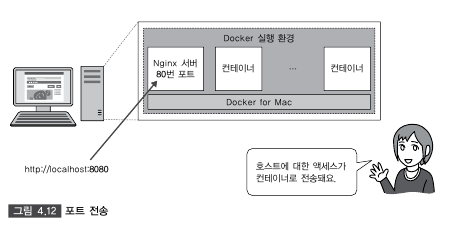

2.1 컨테이너 기술의 개요
==========
### 컨테이너

> 컨네이터란 호스트 OS상에 논리적인 구획(컨테이너)을 만들고, 애플리케이션을 작동시키기 위해 필요한 라이브러리나 애플리케이션 등을 하나로 모아, 마치 별도의 서버인 것처럼 사용할 수 있게 만드는것.  


> Docker는 애플리케이션의 실행에 필요한 환경을 하나의 이미지로 모아두고, 그 이미지를 사용하여 다양한 환경에서 애플리케이션 실행 환경을 구축 및 운용하기 위한 오픈소스 플랫폼이다.

2.2 Docker 개요
==========
### 프로그래머에게 Docker란?


> Docker에서는 각각의 인프라 환경(개발환경, 테스트 환경, 스테이징 환경)(그림 2.6)을 컨테이너로 관리한다. 애플리케이션의 실행에 필요한 모든 파일 및 디렉토리들을 컨테이너로서 모아버리는 것이다.  
>
> 한번 만들면 어디서든지 움직이는 소프트웨어의 특성을 이식성(protability)라고 한다. Docker는 이식성이 높기 때문에 클라우드 시스템과의 친화력도 높은 것이 특징이다.  
> Docker 컨테이너의 바탕이 되는 Docker 이미지만 있으면 애플리케이션을 동일한 환경에서 가동시킬 수 있다. 즉 개발한 업무 애플리케이션을 온프레미스 환경에 대한 이전뿐만 아니라 온프레미스 -> 클라우드나 클라우드 -> 온프레미스 간에도 시스템 요건이나 예산에 따라 손쉽게 실행 환경을 선택할 수 있다.

2.3 Docker의 기능
==========
> Docker에는 크게 3가지의 기능이 있다.
- Docker 이미지를 만드는 기능 (Build)
- Docker 이미지를 공유하는 기능 (Ship)
- Docker 컨테이너를 작동시키는 기능 (Run)

### Docker 이미지를 만드는 기능 (Build)

> Docker는 애플리케이션의 실행에 필요한 프로그램 본체, 라이브러리, 미들웨어, OS나 네트워크 설정 등을 하나로 모아서 Docker 이미지를 만든다.
- Docker 이미지는 애플리케이션의 실행에 필요한 파일들이 저장된 디텍토리이다.
- Docker 이미지는 수동으로 만들 수도 있으며, **Dockerfile**이라는 설정 파일을 만들어 그것을 바탕으로 자동으로 이미지를 만들 수도 있다.

### Docker 이미지를 공유하는 기능 (Ship)

> Docker 이미지를 Docker 레지스토리에서 공유할 수 있다.
- Docker의 공식 레지스트 [Docker Hub](https://hub.docker.com/)
- 공식 Ubuntu나 CentOS와 같은 이미지 외에도 개인이 작성한 이미지를 자유롭게 공개 및 공유 가능

### Docker 컨테이너를 작동시키는 기능 (Run)

> Docker는 Linux 상에서 컨테이너 단위로 서버 기능을 작동 시킨다. 이 컨테이너의 바탕이 되는 것이 Docker 이미지이다.

### Docker 컴포넌트

> Docker는 몇 개의 컴포넌트로 구성되어 있다. 핵심 기능이 되는 Docker Engine을 중심으로 컴포넌트를 조합하여 애플리케이션을 실행 환경을 구축한다.  
>
> **Docker Engine(Docker의 핵심 기능)**  
> - Docker 이미지를 생성하고 컨테이너를 기동시키기 위한 Docker의 핵심 기능.  
> - Docker 명령의 실행이나 DockerFile에 의한 이미지도 생성.  
>
> **Docker Registry(이미지 공개 및 공유)**  
> - 컨테이너의 바탕이 되는 Docker 이미지를 공개 및 공유하기 위한 레지스트리 기능.  
>
> **Docker Compose(컨테니어 일원 관리)**
> - 여러 개의 컨테이너 구성 정보를 코드로 정의하고, 명령을 실행함으로써 애플리케이션의 실행 환경을 구성하는 컨테이너들을 일원 관리하기 위한 툴.
>
> **Docker Machine(Docker 실행 환경 구축)**
> - 로컬 호스트용인  VirtualBox를 비롯하여 Amazon Web Services EC2나 Microsoft Azure와 같은 클라우드 환경에 Docker의 실행 환경을 명령으로 자동 생성하기 위한 툴.
>
> **Docker Swarm(클러스터 관리)**
> - Docker Swarm은 여러 Docker 호스트를 클러스터와하기 위한 툴.

4.1 Docker 이미지 조작 명령어
=====

> #### Docker 버전 확인
> ```bash
> $ docker version
> ```

> #### Docker 실행 환경 확인
> - Docker 실행 환경의 상세 설정이 표시
> ```bash
> $ docker system info
> ```

> #### Docker 디스크 이용 상황
> - Docker가 사용하고 있는 디스크의 이용 상황이 표시
> ```bash
> $ docker system df
> ```

> #### Docker 이미지 다운로드
> nginx를 클라이언트 PC로 이미지 다운로드
> ```bash
> $ docker image pull [옵션] 이미지명[:태크명]
> ```
> 옵션
> - -a: 모든 태그를 취득할 수 있다. -a 옵션을 지장할 때는 이미지명에 태그를 지정 불가.
>
> 

> #### Docker 이미지 확인
> ```bash
> $ docker image ls
> ```
>
> 

> #### 이미지 상세 정보 확인
> ```bash
> $ docker image inspect 이미지명
> ```
>
> 

> #### 이미지 태그 설정
> ```bash
> $ docker image tag <Docker Hub 사용자명>/이미지명:[태크명]
> ```
>
> 

> #### 이미지 검색 
> Docker Hub에 공개되어 있는 이미지를 검색할 때
> ```bash
> $ docker search [옵션] <검색 키워드>
> $ docker search --filter=start=1000 nginx <인기 있는 이미지 검색>
> ```
>
> 
> 

> #### 이미지 삭제
> ```bash
> $ docker image rm [옵션] 이미지명 [이미지명]
> ```
>
> 
>
> #### 사용하지 않은 Docker 이미지를 전체 삭제 
> ```bash
> $ docker image prune [옵션]
> ```
>
> 

> #### Docker Hub에 로그인 
> ```bash
> $ docker login [옵션] [서버]
> ```
>
> 
>
> #### Docker Hub 로그아웃
> ```bash
> $ docker logout [서버명]
> ```


> #### 이미지 업로드 
> ```bash
> $ docker image push <Docker Hub 사용자명>/이미지명[:태그명]
> ```
> 

Docker 컨테이너 생성 / 시작 / 정지
-----

4.2 Docker 컨테이너 생성 / 시작 / 정지
=====
> 이미지가 만들어졌으면 컨테이너를 생성할 수 있다.
### Docker 컨테이너의 라이플 사이클


#### 컨테이너를 조학하기 위한 기본 명령어 네 가지.
> **컨테이너 생성(docker container create 명령)**  
> - 이미지로 부터 컨테이너를 생성한다.  
> - 명령어를 싱행하면 이미지에 포함될 Linux의 디렉토리와 파일들의 스냅샷을 취합한다.  
> 스냅샷이란 스토리지 안에 존재하는 파일과 디렉토리를 특정 타이밍에서 추출한 것을 말한다.  
> - create 명령은 컨테이너를 작성하기만 할뿐 컨테이너를 시작하지 않는다. (시작할 준비가 된 상태가 된 것일뿐.)
>
> 
>
> **컨테이너 생성 및 시작 (docker container run 명령)**  
> - 이미지로 부터 컨테이너를 생성하고 컨테이너 상에서 임의의 프로세스를 시작한다.
>
> **컨테이너 시작 (docker container start 명령)**
> - 정지 중인 컨테이너를 시작할 때 사용
>
> **컨테이너 정지 (docker container stop 명령)**
> - 실행 중인 컨테이너를 정지시킬 때 사용
>
> **컨테이너 삭제 (docker container rm 명령)**
> - 정지 중인 컨테이너를 삭제할 때 사용

> #### 컨테이너 생성 및 시작
> ```bash
> $ docker container run [옵션] 이미지명[:태그명][인수]
> ```
>
> 
> 
> 
>
> #### 컨테이너 백그라운드 실행
> 대화식이 아니라 백그라운드에서 실행
> ```bash
> $ docker container run [실행 옵션] 이미지명[:태그명] [인수]
> ```
>
> 
> - -rm: 실행 후의 컨테이너를 자동으로 삭제 
> - **-restart 옵션**
> 
> - 예를 들어 /bin/bash를 exit 명령으로 종료 해도 자동으로 컨테이너를 재시작 할 때
> 

> #### 컨테이너 네트워크 설정
> ```bash
> $ docker container run [네트워크] 이미지명[:태크명] [인수]
> $ docker container run -d -p 8080:80 nginx
> ```
> nginx라는 이름의 이미지를 바탕으로 컨테이너를 생성하고, 백그라운드에서 실행하고 이때 호스트의 포트 번호 8080과 컨테이너의 포트 번호 80을 매핑
> 
> ```bash
> 컨테이너 DNS 서버 지정
> $ docker container run -d --dns 192.168.1.1 nginx
> ```
> ```bash
> 호스트명과 IP주소 정의
> $ docker container run -it --add-host test.com:192.168.1.1 centos
> ```
> 