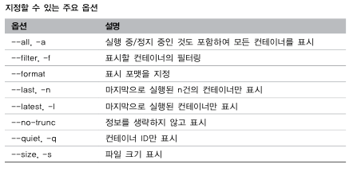
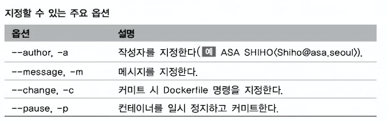
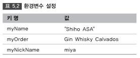

목차
====
- [2.1 컨테이너 기술의 개요](#21-컨테이너-기술의-개요)
  - [컨테이너](#컨테이너)
- [2.2 Docker 개요](#22-docker-개요)
  - [프로그래머에게 Docker란?](#프로그래머에게-docker란)
- [2.3 Docker의 기능](#23-docker의-기능)
  - [Docker 이미지를 만드는 기능 (Build)](#docker-이미지를-만드는-기능-build)
  - [Docker 이미지를 공유하는 기능 (Ship)](#docker-이미지를-공유하는-기능-ship)
  - [Docker 컴포넌트](#docker-컴포넌트)
- [4.1 Docker 이미지 조작 명령어](#41-docker-이미지-조작-명령어)
  - [Docker 버전 확인](#docker-버전-확인)
  - [Docker 실행 환경 확인](#docker-실행-환경-확인)
  - [Docker 디스크 이용 상황](#docker-디스크-이용-상황)
  - [Docker 이미지 다운로드](#docker-이미지-다운로드)
  - [Docker 이미지 확인](#docker-이미지-확인)
  - [이미지 상세 정보 확인](#이미지-상세-정보-확인)
  - [이미지 태그 설정](#이미지-태그-설정)
  - [이미지 검색 ](#이미지-검색)
  - [이미지 삭제](#이미지-삭제)
  - [사용하지 않은 Docker 이미지를 전체 삭제 ](#사용하지-않은-docker-이미지를-전체-삭제)
  - [Docker Hub에 로그인](#docker-hub에-로그인)
  - [Docker Hub 로그아웃](#docker-hub-로그아웃)
  - [이미지 업로드](#이미지-업로드)
- [4.2 Docker 컨테이너 생성/시작/정지](#42-docker-컨테이너-생성시작정지)
  - [Docker 컨테이너의 라이플 사이클](#docker-컨테이너의-라이플-사이클)
  - [컨테이너를 조학하기 위한 기본 명령어 네 가지.](#컨테이너를-조학하기-위한-기본-명령어-네-가지)
  - [컨테이너 생성 및 시작](#컨테이너-생성-및-시작)
  - [컨테이너 백그라운드 실행](#컨테이너-백그라운드-실행)
  - [컨테이너 네트워크 설정](#컨테이너-네트워크-설정)
  - [자원을 지정하여 컨테이너 생성 및 실행](#자원을-지정하여-컨테이너-생성-및-실행)
  - [컨테이너를 생성 및 시작하는 환경을 지정](#컨테이너를-생성-및-시작하는-환경을-지정)
  - [가동 컨테이너 목록 표시](#가동-컨테이너-목록-표시)
  - [컨테이너 가동 확인](#컨테이너-가동-확인)
  - [컨테이너 시작](#컨테이너-시작)
  - [컨테이너 정지](#컨테이너-정지)
  - [컨테이너 재시작](#컨테이너-재시작)
  - [컨테이너 삭제](#컨테이너-삭제)
  - [컨테이너 중단/재개](#컨테이너-중단/재개)
- [4.3 Docker 컨테이너 네트워크](#43-docker-컨테이너-네트워크)
  - [네트워크 목록 표시](#네트워크-목록-표시)
  - [네트워크 작성](#네트워크-작성)
  - [네트워크 연결](#네트워크-연결)
  - [네트워크 상세 정보 확인](#네트워크-상세-정보-확인)
  - [네트워크 삭제](#네트워크-삭제)
- [4.4 가동중인 Docker 컨테이너 조작](#44-가동중인-docker-컨테이너-조작)
  - [가동 컨테이너 연결](#가동-컨테이너-연결)
  - [가동 컨테이너에서 프로세스 실행 ](#가동-컨테이너에서-프로세스-실행)
  - [가동 컨테이너의 프로세스 확인 ](#가동-컨테이너의-프로세스-확인)
  - [가동 컨테이너의 포트 전송 ](#가동-컨테이너의-포트-전송)
  - [컨테이너 이름 변경](#컨테이너-이름-변경)
  - [컨테이너 안의 파일을 복사](#컨테이너-안의-파일을-복사)
  - [컨테이너 조작의 차분 확인](#컨테이너-조작의-차분-확인)
- [4.5 Docker 이미지 생성](#45-docker-이미지-생성)
  - [컨테이너부터 이미지 작성](#컨테이너부터-이미지-작성)
  - [컨테이너를 tar파일로 출력](#컨테이너를-tar파일로-출력)
  - [tar 파일로부터 이미지 작성](#tar-파일로부터-이미지-작성)
  - [이미지 저장](#이미지-저장)
  - [이미지 읽어 들이기](#이미지-읽어-들이기)
  - [불필요한 이미지/컨테이너를 일괄 삭제](#불필요한-이미지컨테이너를-일괄-삭제)
- [5.1 Dockerfile를 사용한 구성 관리](#51-dockerfile를-사용한-구성-관리)
  - [Dockerfile이란?](#dockerfile이란)
  - [Dockerfile의 기본 구문](#dockerfile의-기본-구문)
  - [Dockerfile 작성](#dockerfile-작성)
- [5.2 Dockerfile의 빌드와 이미지 레이어](#52-dockerfile의-빌드와-이미지-레이어)
  - [Dockerfile로부터 Docker 이미지 만들기](#dockerfile로부터-docker-이미지-만들기)
  - [Docker 이미지의 레이어 구조](#docker-이미지의-레이어-구조)
- [5.3 멀티스테이지 빌드를 사용한 애플리케이션 개발](#53-멀티스테이지-빌드를-사용한-애플리케이션-개발)
  - [Dockerfile 만들기](#dockerfile-만들기)
  - [Docker 이미지빌드](#docker-이미지빌드)
  - [Docker 컨테이너 시작](#docker-컨테이너-시작)
- [5.4 명령 및 데몬 실행](#54-명령-및-데몬-실행)
  - [명령 실행(RUN 명령)](#명령-실행run-명령)
  - [데몬 실행(CMD 명령)](#데몬-실행cmd-명령)
  - [데몬 실행(ENTRYPOINT 명령)](#데몬-실행entrypoint-명령)
  - [빌드 완료 후에 실행되는 명령 (ONBUILD 명령)](#빌드-완료-후에-실행되는-명령-onbuild-명령)
  - [시스템 콜 시그널의 설정(STOPSIGNAL 명령)](#시스템-콜-시그널의-설정stopsignal-명령)
  - [컨테이너 헬스 체크 명령(HEALTHCHECK 명령)](#컨테이너-헬스-체크-명령healthcheck-명령)

2.1 컨테이너 기술의 개요
==========
### 컨테이너

> 컨네이터란 호스트 OS상에 논리적인 구획(컨테이너)을 만들고, 애플리케이션을 작동시키기 위해 필요한 라이브러리나 애플리케이션 등을 하나로 모아, 마치 별도의 서버인 것처럼 사용할 수 있게 만드는것.  


> Docker는 애플리케이션의 실행에 필요한 환경을 하나의 이미지로 모아두고, 그 이미지를 사용하여 다양한 환경에서 애플리케이션 실행 환경을 구축 및 운용하기 위한 오픈소스 플랫폼이다.

2.2 Docker 개요
==========
### 프로그래머에게 Docker란?


> Docker에서는 각각의 인프라 환경(개발환경, 테스트 환경, 스테이징 환경)(그림 2.6)을 컨테이너로 관리한다. 애플리케이션의 실행에 필요한 모든 파일 및 디렉토리들을 컨테이너로서 모아버리는 것이다.  
>
> 한번 만들면 어디서든지 움직이는 소프트웨어의 특성을 이식성(protability)라고 한다. Docker는 이식성이 높기 때문에 클라우드 시스템과의 친화력도 높은 것이 특징이다.  
> Docker 컨테이너의 바탕이 되는 Docker 이미지만 있으면 애플리케이션을 동일한 환경에서 가동시킬 수 있다. 즉 개발한 업무 애플리케이션을 온프레미스 환경에 대한 이전뿐만 아니라 온프레미스 -> 클라우드나 클라우드 -> 온프레미스 간에도 시스템 요건이나 예산에 따라 손쉽게 실행 환경을 선택할 수 있다.

2.3 Docker의 기능
==========
> Docker에는 크게 3가지의 기능이 있다.
- Docker 이미지를 만드는 기능 (Build)
- Docker 이미지를 공유하는 기능 (Ship)
- Docker 컨테이너를 작동시키는 기능 (Run)

### Docker 이미지를 만드는 기능 (Build)

> Docker는 애플리케이션의 실행에 필요한 프로그램 본체, 라이브러리, 미들웨어, OS나 네트워크 설정 등을 하나로 모아서 Docker 이미지를 만든다.
- Docker 이미지는 애플리케이션의 실행에 필요한 파일들이 저장된 디텍토리이다.
- Docker 이미지는 수동으로 만들 수도 있으며, **Dockerfile**이라는 설정 파일을 만들어 그것을 바탕으로 자동으로 이미지를 만들 수도 있다.

### Docker 이미지를 공유하는 기능 (Ship)

> Docker 이미지를 Docker 레지스토리에서 공유할 수 있다.
- Docker의 공식 레지스트 [Docker Hub](https://hub.docker.com/)
- 공식 Ubuntu나 CentOS와 같은 이미지 외에도 개인이 작성한 이미지를 자유롭게 공개 및 공유 가능

### Docker 컨테이너를 작동시키는 기능 (Run)

> Docker는 Linux 상에서 컨테이너 단위로 서버 기능을 작동 시킨다. 이 컨테이너의 바탕이 되는 것이 Docker 이미지이다.

### Docker 컴포넌트

> Docker는 몇 개의 컴포넌트로 구성되어 있다. 핵심 기능이 되는 Docker Engine을 중심으로 컴포넌트를 조합하여 애플리케이션을 실행 환경을 구축한다.  
>
> **Docker Engine(Docker의 핵심 기능)**  
> - Docker 이미지를 생성하고 컨테이너를 기동시키기 위한 Docker의 핵심 기능.  
> - Docker 명령의 실행이나 DockerFile에 의한 이미지도 생성.  
>
> **Docker Registry(이미지 공개 및 공유)**  
> - 컨테이너의 바탕이 되는 Docker 이미지를 공개 및 공유하기 위한 레지스트리 기능.  
>
> **Docker Compose(컨테니어 일원 관리)**
> - 여러 개의 컨테이너 구성 정보를 코드로 정의하고, 명령을 실행함으로써 애플리케이션의 실행 환경을 구성하는 컨테이너들을 일원 관리하기 위한 툴.
>
> **Docker Machine(Docker 실행 환경 구축)**
> - 로컬 호스트용인  VirtualBox를 비롯하여 Amazon Web Services EC2나 Microsoft Azure와 같은 클라우드 환경에 Docker의 실행 환경을 명령으로 자동 생성하기 위한 툴.
>
> **Docker Swarm(클러스터 관리)**
> - Docker Swarm은 여러 Docker 호스트를 클러스터와하기 위한 툴.

4.1 Docker 이미지 조작 명령어
=====

#### Docker 버전 확인
> ```bash
> $ docker version
> ```

#### Docker 실행 환경 확인
> - Docker 실행 환경의 상세 설정이 표시
> ```bash
> $ docker system info
> ```

#### Docker 디스크 이용 상황
> - Docker가 사용하고 있는 디스크의 이용 상황이 표시
> ```bash
> $ docker system df
> ```

#### Docker 이미지 다운로드
> nginx를 클라이언트 PC로 이미지 다운로드
>
> 
> ```bash
> $ docker image pull [옵션] 이미지명[:태크명]
> ```
> 옵션
> - -a: 모든 태그를 취득할 수 있다. -a 옵션을 지장할 때는 이미지명에 태그를 지정 불가.

#### Docker 이미지 확인
>
> 
> ```bash
> $ docker image ls
> ```

#### 이미지 상세 정보 확인
> ```bash
> $ docker image inspect 이미지명
> ```
>
> 

#### 이미지 태그 설정
> ```bash
> $ docker image tag <Docker Hub 사용자명>/이미지명:[태크명]
> ```
>
> 

#### 이미지 검색 
> - Docker Hub에 공개되어 있는 이미지를 검색할 때
>
> 
> 
> ```bash
> $ docker search [옵션] <검색 키워드>
> $ docker search --filter=start=1000 nginx <인기 있는 이미지 검색>
> ```

#### 이미지 삭제
>
> 
> ```bash
> $ docker image rm [옵션] 이미지명 [이미지명]
> ```
>
#### 사용하지 않은 Docker 이미지를 전체 삭제 
>
> 
> ```bash
> $ docker image prune [옵션]
> ```

#### Docker Hub에 로그인 
>
> 
> ```bash
> $ docker login [옵션] [서버]
> ```
>
#### Docker Hub 로그아웃
> ```bash
> $ docker logout [서버명]
> ```


#### 이미지 업로드 
> ```bash
> $ docker image push <Docker Hub 사용자명>/이미지명[:태그명]
> ```
> 

4.2 Docker 컨테이너 생성/시작/정지
=====
> 이미지가 만들어졌으면 컨테이너를 생성할 수 있다.
#### Docker 컨테이너의 라이플 사이클


#### 컨테이너를 조학하기 위한 기본 명령어 네 가지.
> **컨테이너 생성(docker container create 명령)**  
> - 이미지로 부터 컨테이너를 생성한다.  
> - 명령어를 싱행하면 이미지에 포함될 Linux의 디렉토리와 파일들의 스냅샷을 취합한다.  
> 스냅샷이란 스토리지 안에 존재하는 파일과 디렉토리를 특정 타이밍에서 추출한 것을 말한다.  
> - create 명령은 컨테이너를 작성하기만 할뿐 컨테이너를 시작하지 않는다. (시작할 준비가 된 상태가 된 것일뿐.)
>
> 
>
> **컨테이너 생성 및 시작 (docker container run 명령)**  
> - 이미지로 부터 컨테이너를 생성하고 컨테이너 상에서 임의의 프로세스를 시작한다.
>
> **컨테이너 시작 (docker container start 명령)**
> - 정지 중인 컨테이너를 시작할 때 사용
>
> **컨테이너 정지 (docker container stop 명령)**
> - 실행 중인 컨테이너를 정지시킬 때 사용
>
> **컨테이너 삭제 (docker container rm 명령)**
> - 정지 중인 컨테이너를 삭제할 때 사용

#### 컨테이너 생성 및 시작
>
> 
> 
> 
> ```bash
> $ docker container run [옵션] 이미지명[:태그명][인수]
> ```
>
#### 컨테이너 백그라운드 실행
> 대화식이 아니라 백그라운드에서 실행
>
> 
> 
> ```bash
> $ docker container run [실행 옵션] 이미지명[:태그명] [인수]
> $ docker container run -it --restart-always centos /bin/bash </bin/bash를 exit 명령으로 종료 해도 자동으로 컨테이너를 재시작 할 때 >
> ```

#### 컨테이너 네트워크 설정
>
> 
> ```bash
> $ docker container run [네트워크] 이미지명[:태크명] [인수]
> $ docker container run -d -p 8080:80 nginx
> ```
> nginx라는 이름의 이미지를 바탕으로 컨테이너를 생성하고, 백그라운드에서 실행하고 이때 호스트의 포트 번호 8080과 컨테이너의 포트 번호 80을 매핑  
>
> 
> ```bash
> 컨테이너 DNS 서버 지정
> $ docker container run -d --dns 192.168.1.1 nginx
> ```
> ```bash
> 호스트명과 IP주소 정의
> $ docker container run -it --add-host test.com:192.168.1.1 centos
> ```

#### 자원을 지정하여 컨테이너 생성 및 실행
> - 컨테이너 시작할 때 CPU와 메모리의 자원 이용을 제한.
> - 기본값으로 cpu-shares는 1024
> - 컨테이너 안의 디렉토리를 공유 가능.
>
> 
> ```bash
> $ docker container run [자원 옵션] 이미지명[:태그명] [인수]
> $ docker container run --cpu-shares=512 --memory=1g centos <cpu-shares의 값을 512로 설정>
> $ docker container run -v /User/asa/webap:/user/share/nginx/html nginx <호스트의 /User/asa/webap 폴더를 컨테이너의 /user/share/nginx/html 디렉토리와 공유>
> ```

#### 컨테이너를 생성 및 시작하는 환경을 지정 
> - 환경변수나 컨테이너 안의 작업 디렉토리 등을 지정 가능
>
> 
> ```bash
> $ docker container run [환경설정 옵션] 이미지명[:태크명] [인수]
> $ docker container run -it -e foo=bar centos /bin/bash <환경변수 지정>
> $ docker container run -it --env-file=env_list centos /bin/bash <환경변수를 정의한 파일로부터 일괄적으로 등록>
> $ docker container run -it -w=/tensorflow centos /bin/bash <컨테이너의 작업 디렉토리를 지정하여 실행>
> ```
>

#### 가동 컨테이너 목록 표시
> - 작동하는 컨테이너의 가동 상태를 확인할 때
>
> 
> 
> ```bash
> $ docker container ls [옵션]
> $ docker container ls -a -f name=test1 <컨테이너 목록 필러링(test1인 것을 조건으로 조회)>
> $ docker container ls -a -f exited=0 <STATUS에 종료 코드가 0인 것>
> ```

#### 컨테이너 가동 확인
> - Docker 상에서 작동하는 컨테이너 가동 상태 확인
>
> 
> ```bash
> $ docker container stats [컨테이너 식별자]
> $ docker container stats webserver <webserver라는 이름의 컨테이너 가동 상황을 확인>
> $ docker container top webserver <컨테이너에서 실행 중인 프로세스를 확인할 때 top 사용>
> ```

#### 컨테이너 시작
> - 정지하고 있는 컨테이너를 시작할 때
> - 여러 개의 컨테이너를 한꺼번에 시작하고 싶을 때는 인수에 컨테이너 식별자를 여러 개 지정 가능
>
> 
> ```bash
> $ docker container start [옵션] <컨테이너 식별자> [컨테이너 식별자]
> $ docker container start dbb4bbe0f470 <dbb4bbe0f470 컨테이너를 시작>
> ```

#### 컨테이너 정지
> - 컨테이너를 정지할 때
>
> 
> ```bash
> $ docker container stop [옵션] <컨테이너 식별자> [컨테이너 식별자]
> $ docker container stop -t 2 dbb4bbe0f470 <dbb4bbe0f470 컨테이너를 2초 후에 정지>
> $ docker container kill <강제적으로 컨테이너를 정지시킬 때>
> ```

#### 컨테이너 재시작
> - 컨테이너를 재시작할 때
>
> 
> ```bash
> $ docker container restart [옵션] <컨테이너 식별자> [컨테이너 식별자]
> $ docker container restart -t 2 webserver <webserver인 컨테이너를 2초 후에 재시작>
> ```

#### 컨테이너 삭제
> - 정지하고 있는 컨테이너를 삭제할 때
>
>
> ```bash
> $ docker container rm [옵션] <컨테이너 식별자> [컨테이너 식별자]
> $ docker container rm dbb4bbe0f470 <dbb4bbe0f470인 컨테이너를 삭제>
> $ docker container prune <정지 중인 모든 컨테이너를 삭제>
> ```

#### 컨테이너 중단/재개
> - 실행중인 컨테이너에서 작동 중인 프로세스를 모두 중단시킬 때
> ```bash
> $ docker container pause <컨테이너 식별자>
> $ docker container pause webserver <webserver인 컨테이너를 일시 중단시킨다>
> $ docker container unpause webserver <중단시킨 webserver의 컨테이너를 재개>
> ```

4.3 Docker 컨테이너 네트워크
=====
> Docker 컨테이너끼리 통신을 할 때는 Docker 네트워크를 통해 수행한다.
#### 네트워크 목록 표시
> - Docker 네트워크 목록을 확인
>
> 
>```bash
> $ docker network ls [옵션]
> $ docker network ls -q driver=bridge <브리지 네트워크 ID만을 목록으로 표시하고 싶을 때>
>```
#### 네트워크 작성 
> - 새로운 네트워크를 작성할 때
>
> 
>```bash
> $ docker network create [옵션] 네트워크
> $ docker network create --driver=bridge web-network <'web-network'라는 이름의 네트워크가 만들어진다. 'bridge'를 지정하고 있기 때문에 브리지 네트워크를 작성한다.>
>```
#### 네트워크 연결 
> - Docker 컨테이너를 Docker 네트워크에 연결 및 해지
>
> 
>```bash
> $ docker network connect [옵션] 네트워크 켄테이너
> $ docker network connect web-network webfront <'webfront'라는 이름의 Docker 컨테이너를 'web-network'라는 이름의 Docker 네트워크에 연결>
> $ docker container inspect <컨테이너 확인>
> $
> $ docker container run -itd --name=webp --net=web-network nginx <컨테이너 시작 시에 네트워크 연결>
> $ docker network disconnect web-network webfront <네트워크 해제할 때>
>```
#### 네트워크 상세 정보 확인
> - 네트워크 상세 정보를 확인할 때
>```bash
> $ docker netowrk inspect [옵션] 네트워크
> $ docker netowrk inspect web-network <'web-network'라는 이름의 네트워크의 상세 정보를 표시>
>```
#### 네트워크 삭제
> - Docker 네트워크를 삭제할 때 
>```bash
> $ docker network rm [옵션] 네트워크
> $ dockwer network rm web-network <'web-network'라는 이름의 네트워크를 삭제한다. 단 삭제 전에 disconnect 명령을 사용하여 연중 해제해야함.>
>```
4.4 가동중인 Docker 컨테이너 조작
=====
> - 이미 가동 중인 컨테이너의 상태를 확인하거나 임의의 프로세스를 실행시킬 때 하는 조작에 대해
#### 가동 컨테이너 연결
> - 연결한 컨테이너 종료 (ctrl + c)
> - 컨테이너 안에서 움직이는 프로세스(이 경우 /bin/bash)만 종료 (ctrl + p, ctrl +)
>```bash
> $ docker container attach sample </bin/bash가 실행되고 있는 sample이라는 이름의 컨테이너에 연결>
>```
#### 가동 컨테이너에서 프로세스 실행 
> - 가동중인 컨테이너에서 새로운 프로세스를 실행할 때
>
> 
>```bash
> $ docker container exec [옵션] <컨테이너 식별자> <실행할 명령> [인수]
> $ docker container exec -it webserver /bin/bash <webserver라는 이름으로 가동 중인 컨테이너에 /bin/bash를 실행 컨테이너 안에서 임의의 명령 실행 가능>
> $ docker container exec -it webserver /bin/bash "hello word" <명령을 직접 실행>
>```
#### 가동 컨테이너의 프로세스 확인 
> - 가동 중인 컨테이너에서 실행되고 있는 프로세스를 확인할 때
>```bash
> $ docker container top <실행 중인 프로세스의 PID와 USER, 실행 중인 명령이 표시 된다.>
> $ docker container top webserver <"webserver"라는 이름의 컨테이너의 프로세스를 확인>
>```
#### 가동 컨테이너의 포트 전송 
> - 가동 중인 컨테이너에서 실행되고 있는 프로세스가 전송되고 있는 포트를 확인
>```bash
> $ docker container port webserver <"webserver"라는 이름의 컨테이너의 포트 전송을 확인>
>```
#### 컨테이너 이름 변경
> - 컨테이너 이름을 변경 
>```bash
> $ docker container rename old new <"old"라는 이름의 컨테이너를 "new"라는 이름으로 변경>
>```
#### 컨테이너 안의 파일을 복사
> - 컨테이너 안의 파일을 호스트에 복사할 때 
>```bash
> $ docker container cp <컨테이너 식별자>:<컨테이너 안의 파일경로> <호스트의 디렉토리 경로>
> $ docker container cp <호스트 파일> <컨테이너 식별자>:<컨테이너 안의 파일경로>
> $ docker container cp webserver:/etc/nginx/nginx.config /tmp/etc <"webserver"라는 컨테이너 안에 있는 /etc/nginx/nginx.config 파이를 호스트의 /tmp/etc안에 복사>
> $ docker container cp cp ./test.txt webserver:/tmp/text.txt <반대로 호스트의 test.txt 파일을 "webserver"라는 이름의 컨테이너 안에 복사>
>```
#### 컨테이너 조작의 차분 확인
> - 컨테이너 안에서 어떤 조작을 하여 컨테이너가 이미지로부터 생성되었을 때와 딸라진 점(차분)을 확인 
>```bash
> $ docker container diff <컨테이너 식별자>
>```
4.5 Docker 이미지 생성
=====
> Docker 컨테이너는 Docker 이미지를 바탕으로 작성하지만 반대로 Docker 컨테이너를 바탕으로 Docker 이미지를 작성할 수도 있다.
#### 컨테이너부터 이미지 작성
> - 컨테이너로부터 이미지를 작성 
>
> 
>```bash
> $ docker container commit [옵션] <컨테이너 식별자> [이미지명[:태그명]]
> $ docker container commit -a "ASA SHIHO" webserver hoheehohee/webfront:1.0 <"webserver"라는 이름의 컨테이너를 "hoheehohee/webfront"라는 이름으로 태그명을 1.0으로 지정하여 새로운 이미지를 작성.>
>```
#### 컨테이너를 tar파일로 출력
> - Docker에서는 가동 중인 컨테이너의 디렉토리/파일들을 모아서 tar파일로 만들 수 있다.
> - 이 tar 파을을 바탕으로 다른 서버에서 컨테이너를 가동시킬수 있다. 
>```bash
> $ docker container export <컨테이너 식별자>
> $ docker container export webserver > latest.tar <"webserver"라는 컨테이너를 "latest.tar"라는 tar 파일로 출력>
> $ tar -tf latest.tar |more <tar 파일의 내용을 확인>
>```
#### tar 파일로부터 이미지 작성 
> - Linux OS 이미지의 디렉토리/파일로부터 Docker 이미지를 만들 수 있다.
>```bash
> $ docker image import <파일 또는 URL> | - [이미지명[:태그명]]
> $ cat latest.tar | docker image import - hoheehohee/webfront:1.1 <latest.tar로 모아놓은 디렉토리나 파일을 바탕으로 "hoheehohee/webfront"라는 이름의 태그명 1.1인 이미지를 작성한다.>
>```
#### 이미지 저장
> - Docker 이미지를 tar 파일로 저장할 수 있다. 
>```bash
> $ docker image save [옵션] <저장 파일명> [이미지명]
> $ docker image save -o export.tar tensorflow <"tensorflow"라는 이름의 이미지를 export.tar에 저장>
>```
#### 이미지 읽어 들이기
> - tar 이미지로부터 이미지를 읽어 들을 수 있다. 
>```bash
> $ docker image load [옵션]
> $ docker image load -i export.tar <"export.tar"라는 이름의 이미지를 읽어 들인다.>
>```
#### 불필요한 이미지/컨테이너를 일괄 삭제
> - 사용하지 않는 이미지, 컨테이너, 볼륨, 네트워크를 일괄적으로 삭제. 
>
> 
>```bash
> $ docker system prune [옵션]
> $ docker system prune -a <사용하지 않는 리소스를 모두 삭제>
>```
5.1 Dockerfile를 사용한 구성 관리
=====
> Docker에서는 인프라 구성을 기술한 파일을 **'Dockerfile'**이라고 한다.
#### Dockerfile이란?
> 베이스가 되는 Docker 이미지를 바탕으로 Docker 컨테이너를 생성하고, 생성한 Docker 컨테이너 안에서 OS의 설정이나 미들웨어의 설치, 파라미터의 설정 등을 수동으로 수행한다. 그리고 만들어진 컨테이너에서 서버를 구축한 상태를 바탕으로 Docker 이미지를 생성한다.  
> 이를 위해서 다음과 같은 정보를 인프라 설계서나 파리미터 시트 등에 별도로 남겨 둘 필요가 있다.
> - 베이스가 될 Docker 이미지
> - Docker 컨테이너 안에서 수행한 조작(명령)
> - 환경변수 등의 설정
> - Docker 컨테이너 안에서 작동시켜둘 데몬 실행
> **Dockerfile은 이와 같은 Docker 상에서 작동시킬 컨테이너의 구성 정보를 기술하기 위한 파일이다.**
#### Dockerfile의 기본 구문
> - 텍스트 형식의 파일
> - 확장자가 필요 없음
> - 'Dockerfile'이라는 이름의 파일에 인프라 구성 정보를 기술
> - Dockerfile 이외의 파일명으로도 작동하지만, 이때 Dockerfile에서 이미지를 빌드할 때 파일명을 명시적으로 지정해야한다.
>
> 
#### Dockerfile 작성
> - Dockerfile에는 'Docker 컨테이너를 어떤 Docker 이미지로부터 생성할지'라는 정보를 반드시 기술해아 한다. 이 이미지를 **베이스 이미지**라고 한다.
> - 다이제스트는 Docker Hub에 업로드하면 자동으로 부여되는 식별자를 말한다.
> ```
> FROM [이미지명]
> FROM [이미지명]:[태그명]
> FROM [이미지명]@[다이제스트]
> ```
> - 테그명을 생략하면 베이스 이미지의 최신 버전(latest)이 적용 된다.
> ```
> # 베이스 이미지 설정
> FROM centos:centos7
> ```
5.2 Dockerfile의 빌드와 이미지 레이어
=====
> Dockerfile을 빌드하면 Dockerfile에 정의된 구성을 바탕으로 한 Docker 이미지를 작성할 수 있다. 
#### Dockerfile로부터 Docker 이미지 만들기
> - Dockerfile로부터 이미지를 생성
> ```
> # 베이스 이미지 설정
> FROM centos:centos7
> ```
> ```bash
> $ docker build -t [생성할 이미지명]:[태그명] [Dockerfile의 위치]
> $ docker build -t sample:1.0 /home/docker/sample <'/home/docker/sample'에 저장된 Dockerfile로부터 sample이라는 이름의 Docker 이미지가 생성된다.>
> ```
> - Docker image ls 명령으로 확인하면 베이스 이미인 centos:centos7과 생성된 sample:1.0이 두 이미지가 만들어 진다.
> ```bash
> $ docker build -d sample -f Dockerfile.base .
> ```
> - Dockerfile에는 임이의 파일명을 붙일 수도 있다.
> - 예를 들어 'Dockerfile.base'라는 이름의 파일을 지정하여 build 가능
> - **. (닷)**으로 나타내므로 빠뜨리면 안된다.
#### Docker 이미지의 레이어 구조
> Dockerfile을 빌드하여 Docker 이미지를 작성하면 Dockerfile의 명령별로 이미지를 작성된다. 작성된 여러 갸의 이미지는 레이어 구조로 되어 있다.
>
> 
>
> 
> - 로그를 확인하면 Dockerfile의 명령 한 줄마다 이미지가 작성된다.
>
> 
>
> 

5.3 멀티스테이지 빌드를 사용한 애플리케이션 개발
=====
> 제품 환경에는 애플리케이션을 실행하기 위해 최소한으로 필요한 실행 모듈만 배치하는것이 효율적으로 활용할 수 있다는 점에서나 보안 관점에서 볼 때 바람직
> 빌드 환경 이미지와 제품 환경 이지미
>
> ;
#### Dockerfile 만들기
> ```
> # 1.Build Image
> # 개발용 언어 Go의 버전 1.8.4를 베이스 이미지로 하여 작성하고 
> # "builder"라는 별명을 붙임.
> FROM golang:1.8.4-jessie AS builder
> 
> # Install dependencies
> # 개발에 필요한 버전을 실치
> WORKDIR /go/src/github.com/asashiho/greet
> RUN go get -d -v github.com/urfave/cli
>
> # Build modules
> # 로컬 환경에 있는 소스코드를 컨테이너 안으로 복사
> # 이 소스코드를 go build 명령으로 빌드하여 'greet'이라는 이름의 실행 가능 바이러니 파일 작성
> COPY main.go
> RUN GOOS=linux go build -a -o greet
>
> # ------------------------------------
> # 2. Production Image
> # 제품 환경용 Docker 이미지의 베이스 이미지로 'busybox'를 사용.
> # BuysBox는 기본적인 Linux 명령들을 하나의 파일로 모아놓은 것으로, 최소한으로 필요한 Linux 쉘 환경을 제공
> FROM busybox
> WORKDIR /opt/greet/bin
> 
> # Deploy module
> # 개발용 환경의 Docker 이미지로 빌드한 'greet'이라는 이름의 실행 가능한 바이너리 파일을 제품 환경용 Docker 이미지로 복사
> # 이때 --from 옵션을 사용하여 'builder'이라는 이름의 이미지로부터 복사를 한다는 것을 선언
> # 마지막으로 복사한 실행 가능 바이너리 파일을 실행.
> COPY --from=builder /go/src/github.com/asashiho/greet/ .
> ENTRYPOINT ["./greet"]
> ```
#### Docker 이미지빌드
> Dockerfile을 빌드
>
> 
> 
> 1. Docker Hub에서 개발용 환경의 베이스 golang:1.8.4를 다운로드
> 2. 그것을 바탕으로 'builder'가 생성
> 3. 이 builder 이미지로 소스코드를 빌드하여 실행 가능 바이러니 파일을 생성
> 4. 제품 환경용 이미지에 실행 가능 바이너리 파일을 복사
> 
> docker images ls로 각각의 이미지 용량을 확인하면 **개발 환경 이미지인 'golang:1.8.4'**는 714MB이지만, 제품 환경용인 **제품 환경용인 'greet'(실행컨테이너)**은 겨우 4.19MB이다.
> 이것은 제품 환경용 베이스 이미지인 'busybox'의 1.13MB에 애플리케이션의 실행에 필요한 모듈만을 추가한 정도라는 것을 알 수 있다.
#### Docker 컨테이너 시작
> 제품 환경용 Docker 이미지인 'greet'를 사용하여 컨테이너를 실행
> ```bash
> $ docker container run -it --rm  greet asa
> Hello asa
> $ docker container run -it --rm  greet --lang=es asa
> Hola asa
> ```
> - 제품 환경용으로 만든 저용량 이미지인 'greet'만으로 작동한다.

5.4 명령 및 데몬 실행
=====
> Dockerfile에서 명령이나 데몬을 실행하는 방법에 대해.
#### 명령 실행(RUN 명령)
> 컨테이너에는 FROM 명령에서 지정한 베이스 이미지에 대해서
> 1. '애플리케이션/미들웨어를 설치 및 설정한다'. 
> 2. '환경 구축을 위한 명령을 실행한다'.
> 3. 가장 많이 사용되며 Dockerfile에 여러 개 기술할 수 있다.
> ```
> RUN [실행하고 싶은 명령]
> ```
> RUN 명령의 두가지 기술 방법
> 1. Sheel 형식
>   - 명령의 지정을 쉘에서 실행하는 형식으로 기술하는 방법
>   - /bin/sh -c를 사용하여 명령을 실행했을 때와 똑같이 작동
>   - Docker 컨테이너에서 실행할 기본 쉘을 변경하고 싶을 때는 Sheel명령을 사용
>   ```
>   # Nginx의 설치
>   RUN apt-get install -y nginx
>   ```
> 2. Exec 형식으로 기술
>   - Exec 형식으로 기술하면 쉘을 경유하지 않고 직접 실행
>   - 명령 인수 $HOME과 같은 환경변수를 지정할 수 없다.
>   - Exec 형식에서는 실행하고 싶은 명령을 JSON 배열로 지정
>   ```
>   # Nginx의 설치
>   RUN ["/bin/bash", "-c", "apt-get install -y nginx"]
>   ```
>
> - 이미지의 레이어에 대해
> ```
> RUN yum -y install httpd
> RUN yum -y install php
> RUN yum -y install php-mbstring
> RUN yum -y install php-pear
> ```
> - Dockerfile을 빌드하면 기술된 명령마다 (한줄 한줄 마다) 내부 이미지가 하나씩 작성된다. 
> - 이미지 생성 및 명령을 줄이는 방법
> ```
> # 한줄로 지정하는 경우
> RUN yum -y install httpd php php-mbstring php-pear
>
> # 줄 바꿈
> RUN yum -y install\
>            httpd\
>            php\
>            php-mbstring\
>            php-pear
> ```
#### 데몬 실행(CMD 명령)
> - 이미지를 바탕으로 생성된 **컨테이너 안에서** 명령을 실행한다.
> - Dockerfile에는 **하나의** CMD명령을 기술할 수 있다.(만약 여러 개를 지정하면 마지막 명령만 유효하다.)
> ```
> CMD [실행하고 싶은 명령]
> ```
> CMD 명령 세가지 기술 방법
> 1. Exec 형식으로 기술
>   - [RUN 명령](#명령-실행(RUN-명령))의 구문과 똑같음
> ```
>   CMD ["nginx", "-g", "daemon off;"]
> ```
> 2. Sheel 형식으로 기술
>   - [RUN 명령](#명령-실행(RUN-명령))의 구문과 똑같음
> ```
>   CMD nginx -g 'daemon off;'
> ```
> 3. ENTRYPOINT 명령의 파라미터로 기술
>   - ENTRYPOINT 명령의 인수를 CMD 명령을 사용할 수 있다.
#### 데몬 실행(ENTRYPOINT 명령)
> ENTRYPOINT 명령에서 지정한 명령은 Dockerfile에서 빌드한 이미지로부터 Docker 컨테이너를 시작하기 때문에 **docker container run 명령을** 실행했을 때 실행된다.
> ```
> ENTRYPOINT [실행하고 싶은 명령]
> ```
> ENTRYPOINT 명령의 두가지 기술 방법
> 1. Exec 형식으로 기술
>   - [RUN 명령](#명령-실행(RUN-명령))의 구문과 똑같음
> ```
>   ENTRYPOINT ["nginx", "-g" "deamon off;"]
> ```
> 2. Sheel 형식으로 기술
>   - [RUN 명령](#명령-실행(RUN-명령))의 구문과 똑같음
> ```
>   ENTRYPOINT nginx -g 'daemon off;'
> ```
> ENTRYPOINT 명령과 CMD 명령의 차이
> - docker container run 명령 실행 시의 동작에 있다.
> - CMD 명령의 경우는 컨테이너 시작 시에 실행하고 싶은 명령을 정의해도 docker container run 명령 실행 시에 인수로 새로운 명령을 지정한 경우 이것을 우선 실행.
> - ENTRYPOINT 명령에서 지정한 명령은 반드시 컨테이너에서 실행되는데, 실행 시에 명령 인수를 지정하고 싶을 때는 CMD명령과 조합하여 사용.
> - ENTRYPOINT 명령으로 실행하고 싶은 명령 저체를 지정, CMD 명령으로는 그 명령의 인수를 지정하면, 컨테이너를 실행했을 때의 기본 작동을 결정할 수 있다.
> ```
> # Docker 이미지 취득
> FROM ubuntu:16.04
> 
> # top 실행
> # ENTRYPOINT 명령으로 top 명령을 실행
> # CMD 명령으로 갱신 간격은 -d 옵션을 10초로 지정, 
> # CMD 명령에서 지정한 옵션을 사용하여 실행 시(docker container run)의 인수를 임으로 지정할 수 있다.
> ENTRYPOINT ["top"]
> CMD ["-d", "10] 
> ```
> ```bash
> $ docker container run -it sample <CMD 명령에서 지정한 10초 간격으로 갱신하는 경우>
> $ 
> $ docker container run -it sample -d 2 <2초 간격으로 갱신하는 경우>
> ```
#### 빌드 완료 후에 실행되는 명령 (ONBUILD 명령)
> ONBUILD 명령은 그 다음 빌드에서 실행할 명령을 이미지 않에 설정하기 위한 명령.
> 예를 들어 Dockerfile에 ONBUILD 명령을 사용하여 어떤 명령을 실행하도록 설정하여 빌드하고 이미지를 작성, 그리고 그 이미지를 다른 Dockerfile에서 베이스 이미지로 설정하여 빌드했을 때 ONBUILD 명령에서 지정한 명령을 실행시킬 수 있다.
> ```
> # ONBUILD [실행하고 싶은 명령]
> ```
> - ONBUILD 명령은 자신의 Dockerfile로부터 생성한 이미지를 베이스 이미지로 한 다른 Dockerfile을 빌드할 때 실행하고 싶은 명령을 기술한다.  
> -  **명령운영의 예**: 웹 시스템을 구축할 때 OS 설치 및 환경 설정이나 웹 서버 설치 및 각종 플러그인 설치 등과 같은 인프라 환경 구축과 관련된 베이스 이미지로 작성
>
> - [smaple source](./sample_code/onbuild)
> ##### Step1 베이스 이미지 작성
> ```
> # 베이스 이미지 설정
> # 먼저 buntu:17.10을 베이스 이미지로 하여 웹서버의 실행 환경을 작성
> FROM ubuntu:17.10
> 
> # Nginx 설치
> RUN apt-get -y update && apt-get -y upgrade
> RUN gpt-get -y install nginx
>
> # 포트 지정
> EXPOSE 80
>
> # 웹 콘텐츠 배치
> ONBUILD ADD website.tar /var/www/html/
>
> # Nginx 실행
> # 데몬을 실행하도록 CMD 명령을 지정
> CMD ["nginx", "-g", "daemon off;"]
> ```
> - Dockerfile.base라는 이름으로 저장
> - docker build 명령을 사용하여 파일명을 지정할 때는 -f 옵션 다음에 파일명을 지정한다.
>
> 
> ##### Step2 웹콘텐스 개발
> - 웹 서버를 작동시키기 위한 인프라 실행 환경이 완성.
> - 그 다음은 웹 콘텐츠를 구축한다.
> - [smaple source](./sample_code/onbuild)에 있는 tar 사용
> ##### Step3 웹 서버용 이미지 작성
> - 그 다음은 웹 서버 실행용 이미지를 작성. 이 이미지에는 베이스 이미지에서 지정한(web-base) 베이스 이미지를 FROM 명령으로 지정한다.
> ```
> # Docker 이미지 취득
> FROM web-base
> ```
> - Dockerfile을 빌드하면 ONBUILD 명령에서 지정한 웹 콘텐츠를 이미지에 추가하는 처리가 실행되므로 **website.tar** 파일은 같은 폴더 위치에 구성해야한다.
>
> 
> - photoview-image라는 이름의 이미지가 생성된다.
> ##### Step4 웹 서버용 컨테이너 시작
> [Step1](#Step1)에서 웹 서버를 작동시키기 위한 실행 환경과 [Step2](#Step2)에서 웹 콘텐츠의 전개가 되었으므로 생성된 이미지를 바탕으로 컨테이너를 시작.
> ```bash
> $ docker container run -d -p 80:80 photoview-image
> ```
> - http://localhost/로 엑세스하면 애플리케이션이 전개 된다.
> 
> ```bash
> $ docker image inspect --format="{{ .Config.OnBuild }}" web-base <ONBUILD 명령이 설정되어 있는지 아닌지 확인하는 명령어>
> ```
>
> 
#### 시스템 콜 시그널의 설정(STOPSIGNAL 명령)
> 컨테이너를 종료할 때에 송신하는 시그널을 설정할 때 사용하는 명령
> ```
> STOPSIGNAL [시그널]
> ```
#### 컨테이너 헬스 체크 명령(HEALTHCHECK 명령)
> 컨테이너 안의 프로세스가 정상적으로 작동하고 있는지 체크할 때 사용하는 명령
> ```
> HEALTHCHECK [옵션] CMD 실행할 명령
> ```
>
> 
> ```
> HEALTHCHECK --interval=5m --timeout=3s CMD curl -f http://localhost/ || exit 1 <5분마다 가동중인 웹 서버의 메인 페이지(http://localhost/)를 3초 안에 표시할 수 있는지 없는지 확인>
> ```

5.5 환경 및 네트워크 설정
=====
> Dockerfile 안에서 이용할 수 있는 환경변수나 컨테이너 안에서의 작업 디렉토리를 지정할 수 있다.
#### 환경변수 설정 (ENV 명령)
> Dockerfile 안에서 환경변수를 설정하고 싶을 때 사용
> ```
> # ENV [key] [value]
> # ENV [key]=[value]
> ```
> 환경변수를 지정하는 두 가지 방법
> 1. key value 형으로 지정하는 경우
> - 단일 환경변수에 하나의 값을 설정한다.
> - 첫 번째 공백 앞을 key로 설정하면 그 이후는 모두 문자열로 취급한다.
> - 공백이나 따옴표와 같은 문자를 포함한 것도 문자로 취급한다.
>
> 
> ```
> ENV myName "Shiho ASA"
> ENV myOrder Gin Whisky Calvados
> ENV MyNickName miya
> ```
> - 이 예에서는 ENV 명령이 3줄에 걸쳐 있으므로 3개의 Docker 이미지를 겹쳐서 만들게 된다.
> 2. key=value로 지정하는 경우
> - 한 번에 여러 개의 값을 설정할 Eo
> ```
> ENV myName="Shiho ASA" \
>     myOrder=Gin\ Whisky\ Calvados \
>     MyNickName=miya
> ```
> - 하나의 ENV 명령으로 여러 개의 값을 설정하므로 만들어진 Docker 이미지는 하나이다.
> - 변수 앞에 \를 추가하면 이스케이프 처리를 할 수 있다. 예를 들어 \$myName은 $myName이라는 리터널로 치환할 수있다.
> 
> ENV 명령으로 지정한 환경변수는 컨테이너 실행 시의 docker container run 명령의 --env 옵션을 사용하여 변경 가능
#### 작업 디렉토리 지정 (WORKDIR 명령)
> Dockerfile에서 정의한 명령을 실행하기 위한 작업용 디렉토리를 지정할 때 사용
> ```
> WORKDIR [작업 디렉토리 경로]
> ```
> - WORKDIR 명령은 Dockerfile에 쓰여 있는 다름과 같은 명령을 실행하기 위한 작업용 디렉토리를 지정
>   - RUN 명령
>   - CMD 명령
>   - ENTRYPOINT 명령
>   - COPY 명령
>   - ADD 명령
> - 만일 지정한 디렉토리가 존재하지 않으면 새로 작성.
> - WORKDIR 명령은 Dockerfile 안에서 여러 번 사용 가능.
> - 상대 경로를 지정한 경우는 이전 WORKDIR 명령의 경로에 대한 상대 경로가 된다.  
>
>   ```
>   WORKDIR /first
>   WORKDIR second
>   WORKDIR third
>   RUN ["pwd"]
>   ```
>   - 마지막 줄 실행 후 **/first/second/third**가 출력
> - WORKDIR 명령에는 ENV 명령에서 지정한 환경변수를 사용할 수 있다.
>
>   ```
>   ENV DIRPATH /first
>   ENV DIRNAME second
>   WORKDIR $DIRPATH/$DIRNAME
>   RUN ["pwd"]
>   ```