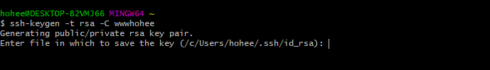
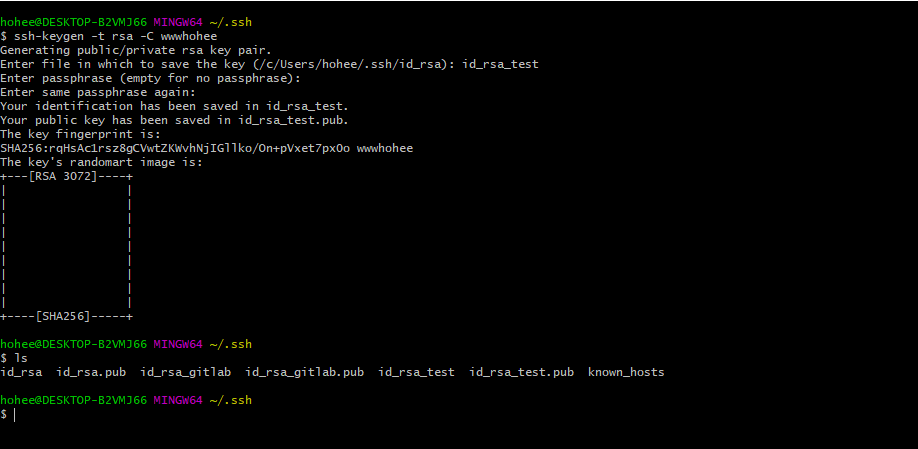
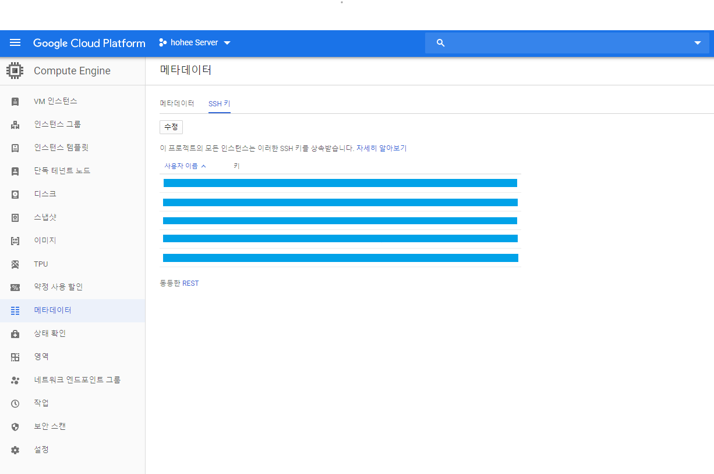

Google Cloud VM SSH Setting
========
> 클라우드 VM을 생성하고 해당 VM에 접속하기 위해서 SSH 연결을 한다.

SSH 키페어 생성
-------
> ssh-keygen 명령어를 이용하요 RSA(공개키 암호화시스템) 키페어 생성.

`ssh-keygen -t rsa -C 구글계정`
- -t 옵션: 암호화 타입을 정의
- -C 옵션: 주석을 입력, 주석은 서버에 따라 특별한 용도로 사용(github에서는 사용자의 로그인 ID를 적어놓으라고 가이드함.)
- 처음 키페어를 생성하면 default로 id_rsa file로 생성 되고 키페어를 이미 생성 했다면 엔터 입력전에 file 명을 주면 또 다른 키페어가 생성된다.

> ssh key가 생성 되었으면 *.pub으로 끝나는 이름의 퍼블릭키의 내용을 복수한다.

> 복사한 ssh key 퍼블릭 텍스트를 google cloud에서 Compute Engine > 메타데이터(Metadata) > SSH Keys 부분에 키를 등록한다.

> 키 등록이 끝나면 해당 키를 이용 SSH로 접속

`ssh 계정@호스트명`