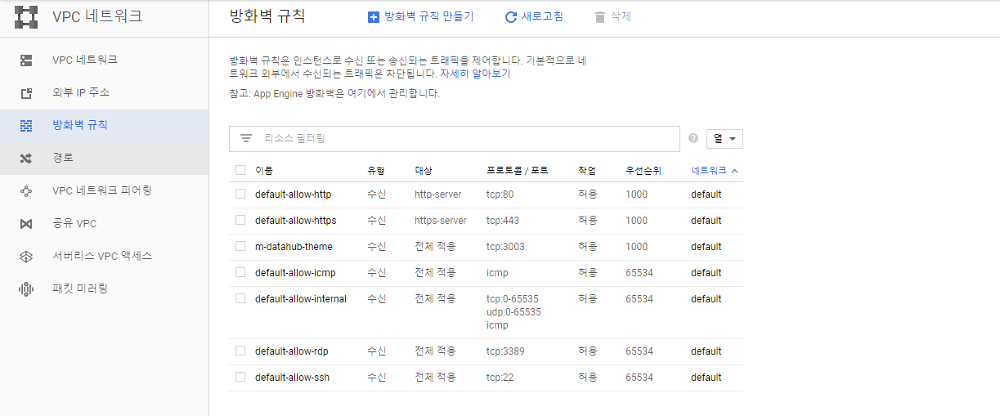
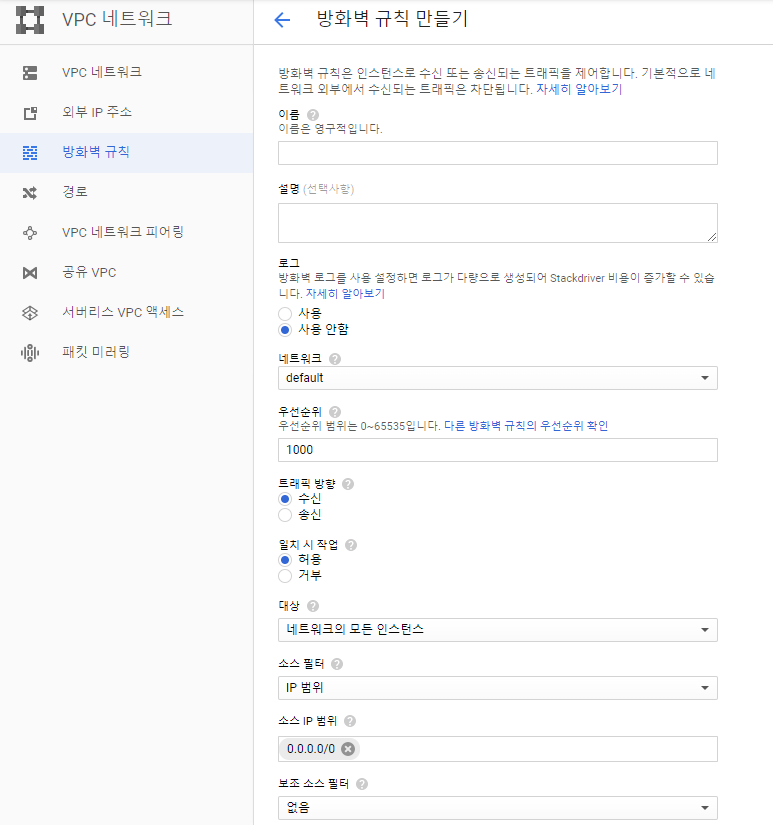
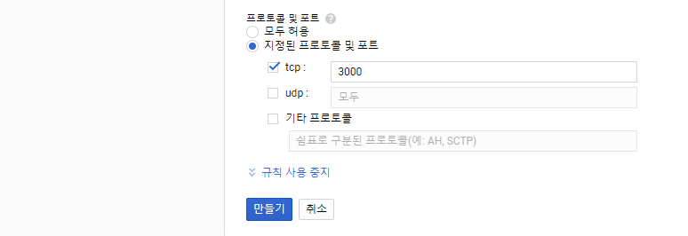

Google Cloud 방화벽(포트 설정)
========
> 기본적으로 GCP(Google Cloud Platform)의 인스턴스는 80, 433, 22 등의 특정 포트에 대해서만 접근이 가능하도록 설정 되어 있다.  
처음 설치한 웹 서버의 포트가 80이라면 정상적으로 접속이 될 수 있지만 만약 사용하는 포트 번호가 3000, 8080과 같은 포트 번호를 사용한다면 정상적으로 접근이 되지 않는다.  
이를 위해 GCP에서도 해당 포트를 열어주어야 하는데 그 방법은 **VPC 네트워크 > 방화병 규칙** 메뉴에서 포트를 설정해주면 된다.

