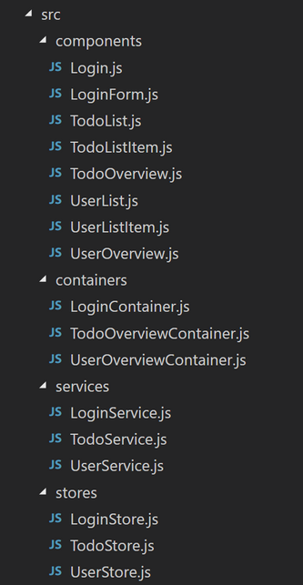
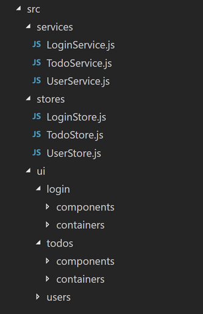
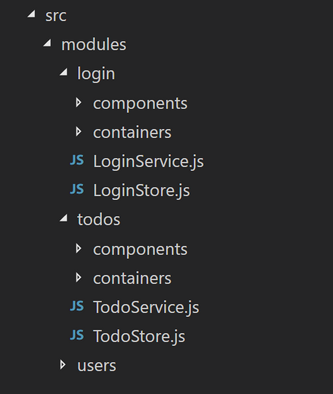

# Mobx React App을 구조화하는 방법
프로젝트 구조는 애플리케이션 개발에 중요한 역할한다. 귀하와 귀하의 팀 동료가 탐색하는 코드를 신속하게 찾을 수 있도록 도와준다. 또한 애플리케이션 아키텍처의 토대를 마련한다. 사람들은 폴더 계층 구조가 어떻게 구성되어 있으며 각 폴더와 파일의 이름이 어떻게 표시되는지 살펴봄으로써 응용 프로그램 아키텍처의 대략적인 개요를 볼 수 있다. 또한 사람들이 프로젝트에 참여하여 신속하게 주위를 찾아 새로운 파일을 추가해야하는 위치와 이름 지정 방법을 알 수 있다. 예를 들어 모든 serivces가 폴더 serivces 아래에 있고 접미사가 'Service'인 경우 해당 폴더 아래에 새 서비스를 추가하고 적절하게 이름을 지정한다.

당신의 프로젝트 구조를 바로 잡음으로써 얻을 수 있는 이 모든 이점들과 함께, 이제 문제는 "올바른 mobx는 프로젝트 구조에 어떻게 반응합니까?"이다.
하지만 슬프게도 대답은 다음과 같다: "글쎄요, 상황에 따라 다르죠."

다음에서, 일반적으로 사용되는 세 개의 mobx 반응 프로젝트 구조를 보여 줄 것이며, 이것은 여러분이 결정을 내리거나 청사진 역할을 하도록 도울 것이다.

## 유형별 프로젝트 구조

이제 우리는 stores, services, components, containers를 가지고 있다. 가장 간단한 방법은 유형별로 구조화하는 것이다. 그래서 모든 stores들은 stores 밑에 있고, services는 services 아래에 있다. 이것은 다음의 예시 구조를 이끌어낸다.

store들은 services를 참조하거나 서로 참조하며, 각 containers는 하나 이상의 components로 구성되며, 각 components는 0개 이상의 다른 components로 구성된다.

이 구조에 대한 한 가지 반대되는 점은 그것이 잘 확장되지 않는다는 것이다. 프로젝트가 더 커질 때, 새로운 기능을 구현하는 것은 프로젝트 구조에 대한 많은 검색을 필요로 한다.
tobo list에서 목록을 제거하기 위한 button를 구현하고 싶다고 하자
이제 TodoListItem, TodoStore 및 TodoService가 필요하다.
이 예에서 그러한 클래스를 찾는 것은 쉽지만, 큰 프로젝트에서 그것은 지루한 작업이 된다.

#### 장점
* root 폴더 바로 아래에 있기 때문에 services, stores 또는 다른 유형을 빠르게 찾을 수 있다.
* 재사용성을 향상시킨다. 다른 stores들이 어떤 것을 이용할 수 있는지 정확히 알고 있다. 다른 유형도 마찬가지 이다.
* 배우기 쉽고 이해하기 쉽고 새로운 classes를 추가 할 수 있다.

#### 단점
* 매우 평평한 구조로 인해 폴더 (특히 components 폴더)가 매우 빠르게 커질 수 있다.
* components, containers 및 stores 간의 의존성은 실제로 보이지 않는다.
* 프로젝트가 커지면 특정 기능을 구현하는 데 필요한 stores, services 및 controllers/conponents를 찾는 것이 매우 어렵다.

### 유형과 기능성의 혼합
대부분의 경우 containers 및 conpoments 폴더가 매우 빠르게 커진다. 어떻게 우리가 구조를 개선 할 수 있을까?

우리가 여기서 한 것은 문제가되는 폴더 (containers 및 components)를 가져 와서 기능별로 구조화하는 것이다. 자녀의 기능을 설명하는 ui 폴더를 추가한다.
그런 다음 components/containers의 기능에 따라 ui 폴더를 구성했다. Login, Todos 및 로그인에 사용할 모든 ui components/contaiers에 대한 폴더를 생성했다.
이 솔루션은 유형이 지정된 구조 (services, stores)와 기능적 구조 (하위 폴더)를 혼합한 것이다.

#### 장점
* 이제 containers와 components가보다 나은 구조를 가지며 쉽게 찾을 수 있습니다.
* 구성요소와 containers 사이의 의존성이 이제 더욱 명확해졌다(하나의 기능(로그인)에서 다른 기능(todos, users)의 다른 containers/components에 대한 참조는 금지된다).

#### 단점
* ui 코드와 stores들 사이의 의존성은 구조를 살펴봄으로써 명확하지 않다.

### 함수 / 모듈 별 프로젝트 구조
이제는 완벽하게 기능 할 수 있게 되었다. faguest

여기서 우리가 한 일은 모든 기능을 하나의 모듈 폴더에 집어넣는 것이 었다. 따라서 로그인 기능을 위해 모든 containers, components, stores 및 services 동일한 폴더 아래에 있다.
이것은 어떤 components에 어느 stores에 속하는지 그 반대가 되는지를 파악하는 명확한 구조로 이어진다.

> 우리는 각 모듈에 index.js 파일을 추가하고, 오직 파일만 내보냄으로써 모듈 밖에서 사용할 수 있도록 모듈성을 개선할 수 있다.

#### 장점
* 이제 모든 의존성을 볼 수 있다.
* (index.js를 통해) 각 번들에 대해 내보낸 파일 제어

#### 단점
* 이제 다른 애플리케이션(stores 및 services)은 더 이상 단일 폴더에 있지 않기 때문에 비즈니스 로직을 재사용하기가 더 어려워졌다.
* 가장 강력한 원칙 필요하다(다른 모듈에서 내보낸 파일만 사용하고 다른 모듈에 대한 종속성을 낮게 유지)

요약하면 앱을 구성하는 방법에는 여러 가지가 있습니다. 옳고 그름은 없습니다.
프로젝트에 필요한 구조를 만들거나 이 글에서 여러분에게 영감을 불어 넣어 자신 만의 아이디어를 만들어보십시오.
이 글이 현재 또는 미래의 프로젝트에 대한 프로젝트 구조를 개선하는 데 도움이되기를 바랍니다.